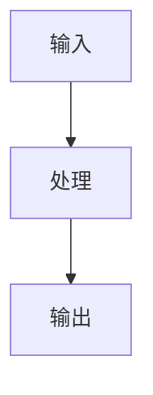

# Starry Blog 使用与维护手册

> Starry Blog 是一个基于 Next.js 的个人博客与个人品牌站，用于展示技术文章、项目作品、个人介绍和在线简历。
>
> 本手册面向站点维护者。需要写内容、更新资料、调整配置、发布网站或排查故障时，按对应章节操作即可。

## 目录

1. [快速开始](#1-快速开始)
2. [内容管理](#2-内容管理)
3. [个人资料与页面维护](#3-个人资料与页面维护)
4. [网站配置](#4-网站配置)
5. [发布与部署](#5-发布与部署)
6. [域名、SEO 与安全](#6-域名seo-与安全)
7. [故障排查](#7-故障排查)
8. [项目维护](#8-项目维护)
9. [附录 A：快速速查](#附录-a快速速查)
10. [附录 B：文章 Frontmatter 模板](#附录-b文章-frontmatter-模板)
11. [附录 C：项目 Frontmatter 模板](#附录-c项目-frontmatter-模板)
12. [附录 D：核心文件说明](#附录-d核心文件说明)

---

# 1. 快速开始

## 1.1 项目简介

Starry Blog 使用 Git 管理内容。文章和项目保存在仓库的 Markdown 文件中，不依赖数据库，也没有网页后台。

```text
编辑 Markdown → 本地校验与预览 → Commit / Push → Vercel Preview
→ 合并 main → Vercel Production
```

在线站点：`https://www.starrylovetbao.cloud`

GitHub：`https://github.com/wanghongyu666qiang/starry-blog`

## 1.2 技术栈

- Next.js 16、React 19、TypeScript；
- Tailwind CSS 4；
- Markdown、React Markdown、GFM；
- KaTeX、Mermaid、Highlight.js；
- Zod、Vitest、ESLint；
- Vercel Analytics、Speed Insights；
- GitHub Actions、Vercel。

实际版本以 `package.json` 和 `package-lock.json` 为准。

## 1.3 项目结构

```text
starry-blog/
├─ .github/workflows/ci.yml       # GitHub Actions CI
├─ public/                        # 头像、图片等静态资源
├─ src/
│  ├─ app/                        # 页面、Metadata、RSS、Sitemap、Robots
│  ├─ components/                 # 页面与 Markdown 组件
│  ├─ content/posts/              # 文章 Markdown
│  ├─ content/projects/           # 项目 Markdown
│  └─ lib/                        # Schema、数据逻辑、站点配置和类型
├─ tests/                         # 自动测试
├─ next.config.ts                 # Next.js 与安全响应头
├─ package.json                   # 命令和依赖
├─ publish.sh                     # 内容快速发布脚本
└─ 使用手册.md
```

## 1.4 环境准备

CI 使用 Node.js 24，日常维护也推荐 Node.js 24，并准备 npm 和 Git：

```powershell
node -v
npm -v
git --version
```

PowerShell 如果提示 `npm.ps1 cannot be loaded`，使用 `npm.cmd`。电脑中已安装 WSL，`publish.sh` 可在 WSL 或 Git Bash 中运行。

## 1.5 安装与启动

```powershell
git clone https://github.com/wanghongyu666qiang/starry-blog.git
cd starry-blog
npm.cmd ci
npm.cmd run dev
```

打开 `http://localhost:3000`。开发与生产构建命令均固定使用 Webpack。`npm ci` 严格按锁文件安装；主动增删或升级依赖时才使用 `npm install`。

## 1.6 常用命令

| 命令 | 用途 |
| --- | --- |
| `npm.cmd run dev` | 启动开发服务器 |
| `npm.cmd run content:validate` | 校验全部文章和项目 |
| `npm.cmd run lint` | ESLint |
| `npm.cmd run typecheck` | TypeScript 类型检查 |
| `npm.cmd test` | 全部 Vitest 测试 |
| `npm.cmd run build` | 生产构建 |
| `npm.cmd start` | 启动已完成的生产构建 |
| `npm.cmd run check` | 内容校验、Lint、类型检查、测试、构建 |

只修改 Markdown 时，至少执行内容校验并在浏览器预览；修改代码、配置或依赖时，发布前执行完整 `npm.cmd run check`。

## 1.7 页面入口

| URL | 用途 |
| --- | --- |
| `/` | 首页、个人简介、精选项目和文章 |
| `/projects`、`/projects/[slug]` | 项目列表与详情 |
| `/articles`、`/articles/[slug]` | 文章列表、搜索、筛选与详情 |
| `/about` | 关于页面 |
| `/resume` | 在线简历 |
| `/feed.xml` | RSS |
| `/sitemap.xml` | Sitemap |
| `/robots.txt` | 爬虫规则 |

---

# 2. 内容管理

## 2.1 文章管理

### 新建文章与 slug

文章放在 `src/content/posts/`。文件名就是 URL slug：

```text
src/content/posts/nextjs-learning-notes.md
→ /articles/nextjs-learning-notes
```

slug 只允许小写字母、数字和单个连字符：

```text
^[a-z0-9]+(?:-[a-z0-9]+)*$
```

合法：`nextjs-learning-notes.md`、`cpp-01.md`。

非法：`NextJs.md`、`我的文章.md`、`hello_world.md`、`hello world.md`、`test--article.md`。

创建后复制[附录 B](#附录-b文章-frontmatter-模板)的模板。

### Frontmatter 字段

文章使用严格 Zod Schema。未知字段、拼错字段、错误类型都会导致校验失败。

| 字段 | 必填 | 规则与用途 |
| --- | --- | --- |
| `title` | 是 | 2～120 个字符 |
| `description` | 是 | 10～240 个字符；用于列表、搜索和 SEO |
| `date` | 是 | 有效的 `YYYY-MM-DD` |
| `updated` | 否 | 省略时自动使用 `date` |
| `category` | 是 | `Engineering`、`Research`、`Learning`、`Thoughts` |
| `tags` | 否 | 数组；单项 1～40 个字符，读取时去重 |
| `published` | 否 | 是否公开，默认 `false` |
| `featured` | 否 | 首页排序优先级，默认 `false` |
| `cover` | 否 | `null`、站内绝对路径或 HTTP/HTTPS URL |
| `canonicalUrl` | 否 | `null` 或 HTTP/HTTPS 原始发布地址 |

分类建议：

| 分类 | 内容 |
| --- | --- |
| `Engineering` | 工程实践、架构、开发、踩坑 |
| `Research` | 论文阅读、AI、科研 |
| `Learning` | 算法、数据结构、课程笔记 |
| `Thoughts` | 开发感悟、个人思考 |

### 草稿、发布与精选

- `published: false` 不会出现在公开列表、首页、RSS、Sitemap 或详情页。
- 公开文章默认按 `date` 从新到旧排序。
- 首页先把 `featured: true` 排在前面，再按日期排序，最后取 3 篇。
- `featured` 不是首页准入开关；精选不足 3 篇时，非精选公开文章也会补位。

未完成内容应保留文件并设为草稿。修改正文时应同步维护 `updated`。

确需删除时，可通过 Git 删除并检查是否有旧链接：

```powershell
git rm src/content/posts/文章-slug.md
npm.cmd run content:validate
```

部署后旧 URL 会返回 404；需要保留旧链接或搜索权重时，应先设计重定向。

## 2.2 Markdown 写作

### 标题与目录

文章页从正文 H2、H3 提取目录：

```markdown
## 章节

### 小节
```

Frontmatter 的 `title` 已是页面主标题，正文通常不必重复 H1。

### 图片与链接

图片推荐放在 `public/images/`，Markdown 使用站内绝对路径和有意义的 alt：

```markdown

```

不要使用 `C:\...`、`D:\...` 等本机路径。内容校验会拒绝缺少 alt 的 Markdown 图片。外链图片应使用可长期访问的 HTTPS URL。

链接写法：

```markdown
[GitHub](https://github.com/)
```

HTTP/HTTPS 外链会在新标签页打开。

### 代码、公式与 Mermaid

````markdown
```cpp
int main() {
    return 0;
}
```
````

代码块会高亮并提供复制按钮。

```markdown
行内公式 $E = mc^2$

$$
E = mc^2
$$
```

公式由 KaTeX 渲染。Mermaid 必须使用 `mermaid` 语言标记：

````markdown

````

### GFM

项目支持表格、任务列表、删除线等 GitHub Flavored Markdown：

```markdown
| 算法 | 时间复杂度 |
| --- | --- |
| DFS | O(V + E) |
| BFS | O(V + E) |
```

## 2.3 文章自动功能

### 阅读时间与难度

`src/lib/data.ts` 自动计算阅读时间：

```text
ceil((中文字符数 + 英文单词数) / 400)，最少 1 分钟
```

难度也由分类自动生成：

| 分类 | 难度 |
| --- | --- |
| `Engineering`、`Research` | 进阶 |
| `Learning`、`Thoughts` | 入门 |

不要增加 `reading_time` 或 `difficulty`，严格 Schema 会拒绝未知字段。

### 搜索、筛选与 RSS

- `/articles` 只搜索 `title`、`description`、`tags`，不搜索 Markdown 正文；
- 搜索是不区分大小写的包含匹配；
- 支持四类文章筛选；
- 可组合使用 `/articles?q=next&category=Engineering`；
- `/feed.xml` 自动包含所有公开文章，草稿不进入 RSS。

## 2.4 项目管理

项目放在 `src/content/projects/`，文件名同样是 slug，如 `askbridge.md` 对应 `/projects/askbridge`。

| 字段 | 必填 | 规则与用途 |
| --- | --- | --- |
| `title` | 是 | 2～120 个字符 |
| `description` | 是 | 10～240 个字符 |
| `date` | 是 | 有效的 `YYYY-MM-DD` |
| `updated` | 否 | 省略时使用 `date` |
| `role` | 是 | 个人职责，4～300 个字符 |
| `tech_stack` | 是 | 至少一项；单项 1～40 个字符，读取时去重 |
| `github_url` | 否 | `null` 或 HTTP/HTTPS URL |
| `demo_url` | 否 | `null` 或 HTTP/HTTPS URL |
| `status` | 是 | `草稿`、`进行中`、`已完成` |
| `featured` | 否 | 首页排序优先级，默认 `false` |
| `cover` | 否 | `null`、站内绝对路径或 HTTP/HTTPS URL |

`role` 应说明实际职责，项目描述、性能数字和贡献应可验证。`status: "草稿"` 不会进入公开列表、首页、Sitemap 或详情页。

首页项目同样按 `featured` 优先、日期次序排列并取前 3 个；非精选项目可以补位。模板见[附录 C](#附录-c项目-frontmatter-模板)。

---

# 3. 个人资料与页面维护

## 3.1 修改位置速查

| 要修改的内容 | 主要位置 |
| --- | --- |
| 网站名称、标题、描述、域名、作者信息 | `src/lib/site.ts` |
| 首页头像 | `public/avatar.jpg` |
| 首页身份、介绍、标签、按钮、联系方式 | `src/components/HeroSection.tsx` |
| 首页 Metadata 与 JSON-LD | `src/app/page.tsx` |
| About 页面及 Metadata | `src/app/about/page.tsx` |
| Resume 页面及 Metadata | `src/app/resume/page.tsx` |
| 顶部导航 | `src/components/Header.tsx` |
| 页脚 | `src/components/Footer.tsx` |
| 主题选项 | `src/components/ThemeSwitcher.tsx` |
| 主题颜色、布局和动效 | `src/app/globals.css` |

个人信息不是统一数据源生成的。完整更新至少检查：

```text
src/lib/site.ts
src/components/HeroSection.tsx
src/app/page.tsx
src/app/about/page.tsx
src/app/resume/page.tsx
```

## 3.2 首页

`src/components/HeroSection.tsx` 控制头像、身份、介绍、技能标签、主要按钮、GitHub 和 Email。头像 `/avatar.jpg` 对应 `public/avatar.jpg`，替换时建议使用接近正方形的图片并检查裁剪效果。

首页文章与项目区域位于 `src/app/page.tsx`，当前各读取 3 条。修改数量时同时检查数据调用、网格和移动端布局。

## 3.3 About

`src/app/about/page.tsx` 包含个人介绍、开发理念、教育、技能、兴趣和联系方式。这些内容直接写在 TSX 中，不会自动读取 `site.ts` 或 Resume。修改正文时也检查文件顶部 Metadata。

## 3.4 Resume

`src/app/resume/page.tsx` 包含教育、项目、技能、获奖和实习。

> Resume 不会从 `src/content/projects/` 自动同步。

修改项目 Markdown 后，如果变化也应出现在简历中，需要手动修改 Resume。

## 3.5 导航与页脚

导航项定义在 `src/components/Header.tsx` 的 `NAV_ITEMS`。新增页面后，如需导航入口，在此增加，并检查桌面端、移动端和当前页高亮。页脚位于 `src/components/Footer.tsx`。

## 3.6 主题

`src/components/ThemeSwitcher.tsx` 当前提供：暖色 `warm`、星空 `starry`、浅色 `light`、灰色 `gray`、深色 `dark`。

选择保存在 `localStorage` 的 `starry-theme`。`src/app/layout.tsx` 加载时读取它，缺失或读取失败时使用 `warm`。

主题颜色位于 `src/app/globals.css`。增加主题时必须同时修改选择器和 CSS，并测试刷新后的持久化。

---

# 4. 网站配置

## 4.1 全局配置

`src/lib/site.ts` 包含 `SITE_URL`、网站名称、标题、描述、语言、作者、GitHub、Email 和 `absoluteUrl()`。

`src/app/layout.tsx` 使用它生成默认 Metadata、Open Graph、Twitter Card、作者和发布者。首页与详情页还会生成 JSON-LD。修改 `site.ts` 不会替换 Hero、About、Resume 中直接写入的文案或链接。

## 4.2 文章分类

分类源在 `src/lib/types.ts` 的 `POST_CATEGORIES`。新增分类不能只改 Markdown，至少同步检查：

```text
src/lib/types.ts
src/app/articles/ArticlesClient.tsx
src/lib/data.ts
tests/
```

Schema 从分类常量生成，文章页有独立菜单，难度计算也依赖分类。

## 4.3 内容 Schema

`src/lib/content-schema.ts` 负责文章和项目字段、日期、URL、slug、未知字段和 Markdown 图片 alt 校验。

新增 Frontmatter 字段通常要同步修改：

```text
src/lib/content-schema.ts
src/lib/types.ts
src/lib/data.ts
相关页面或组件
tests/
使用手册.md
```

## 4.4 数据读取

`src/lib/data.ts` 负责读取 Markdown、验证、过滤草稿、去重、排序、精选优先级、阅读时间、难度、按 slug 获取详情和全部内容校验。修改这些规则时应补充测试。

## 4.5 Markdown Renderer

`src/components/MarkdownRenderer.tsx` 负责 GFM、公式、代码高亮、Mermaid、标题锚点、复制、表格、图片和外链。目录提取位于 `src/lib/markdown.ts`，目录 UI 位于 `src/components/TableOfContents.tsx`。

扩展脚注、提示框、视频等能力时，还要考虑构建与客户端渲染、CSP、移动端、无障碍、安全、测试和手册同步。

---

# 5. 发布与部署

## 5.1 内容发布

只修改文章或项目 Markdown 时：

```text
更新 main、创建分支 → 编辑 Markdown → content:validate → 本地预览
→ Commit / Push → GitHub CI 与 Vercel Preview → 合并 main → Production 验证
```

预览时至少检查详情页、列表、首页补位，以及本次涉及的图片、目录、代码、公式或 Mermaid。

## 5.2 代码发布

修改 React、Next.js、TypeScript、CSS、Schema、数据、SEO、构建配置或依赖时：

```text
创建分支 → 修改代码 → npm.cmd run check → 本地浏览器测试
→ Commit / Push → GitHub Actions → Vercel Preview → 合并 → Production 验证
```

`content:validate` 只验证内容契约，不能覆盖 Lint、类型、全部测试和生产构建问题。

## 5.3 `publish.sh`

WSL、Git Bash 或 Bash 环境中可运行：

```bash
./publish.sh "新增文章：标题"
```

脚本依次执行内容校验、`git add src/content/`、提交和推送当前分支。它：

- 只暂存 `src/content/`；
- 不提交组件、页面、README 或本手册；
- 不运行 Lint、类型检查、完整测试或生产构建；
- 不强制推送 `main`；
- 不能代替 Preview 和 Production 验证。

## 5.4 GitHub Actions

CI 位于 `.github/workflows/ci.yml`，在 Pull Request 和 `main` push 时运行。当前使用 Node.js 24，依次执行：

```text
npm ci
npm run content:validate
npm run lint
npm run typecheck
npm test
npm run build
```

任一步失败都会使 CI 失败。应打开具体 Workflow 的失败步骤查看真实错误。

## 5.5 Vercel

```text
工作分支或 Pull Request → Preview Deployment
main                      → Production Deployment
```

本地通过、Commit、Push、Preview、合并和 Production 是不同阶段。只有主域名上的目标版本完成实际验证，才能认为发布完成。

## 5.6 发布检查

### 所有改动

- [ ] `content:validate` 通过；
- [ ] 本次涉及的页面已本地预览；
- [ ] 草稿没有公开；
- [ ] 图片和 alt 正确；
- [ ] Commit / Push 文件范围正确，没有 Secret；
- [ ] GitHub CI 与 Vercel Preview 通过；
- [ ] 合并后 Production 成功且主域名显示目标版本。

### 代码或配置改动追加检查

- [ ] `npm.cmd run check` 完整通过；
- [ ] 首页、文章、项目、About、Resume 正常；
- [ ] 桌面与移动导航正常；
- [ ] 主题切换和刷新持久化正常；
- [ ] 代码复制、目录、KaTeX、Mermaid 正常；
- [ ] `/feed.xml`、`/sitemap.xml`、`/robots.txt` 正常；
- [ ] canonical、Open Graph、动态 OG 图和 JSON-LD 正确；
- [ ] 浏览器控制台没有新增错误或 CSP 拦截。

---

# 6. 域名、SEO 与安全

## 6.1 域名

规范主域名：`https://www.starrylovetbao.cloud`。

代码中的主域名定义在 `src/lib/site.ts` 的 `SITE_URL`。根域名 `https://starrylovetbao.cloud` 应单向跳转到 `www` 主域名。

更换域名时至少检查：

```text
src/lib/site.ts
Vercel Domains 与重定向
canonical、Sitemap、Robots、RSS
Open Graph、Twitter Card、动态 OG 图片、JSON-LD
README.md、使用手册.md
```

不要在 Next.js 与 Vercel 中配置相反方向的跳转，否则可能形成 `ERR_TOO_MANY_REDIRECTS`。

## 6.2 SEO

站点使用 Next.js Metadata、canonical、Open Graph、Twitter Card、动态 OG 图、Sitemap、Robots、RSS 和 JSON-LD。

结构化数据包括 `Person`、`WebSite`、`BlogPosting`、`SoftwareSourceCode`。全局 Metadata 在 `src/app/layout.tsx`，页面级 Metadata 在各页面文件，文章与项目详情根据内容动态生成。

`canonicalUrl` 只用于文章的原始发布地址。本站原创文章通常填 `null` 或省略，让程序使用本站详情 URL。

## 6.3 Sitemap、Robots 与 RSS

- `src/app/sitemap.ts` 生成 `/sitemap.xml`，包含静态页面与所有公开文章、项目；新增重要页面时需同步增加。
- `src/app/robots.ts` 生成 `/robots.txt`，当前允许抓取全站，并声明 Sitemap 与主机。
- `src/app/feed.xml/route.ts` 生成 RSS 2.0，使用全局站点信息和公开文章；草稿不会进入 RSS。

## 6.4 安全响应头

`next.config.ts` 设置 Content-Security-Policy、Referrer-Policy、X-Content-Type-Options、X-Frame-Options、X-DNS-Prefetch-Control、Permissions-Policy 和 HSTS。

除非明确理解影响，不要为解决单个加载问题删除整套安全配置。

## 6.5 CSP

接入评论、统计、图片 CDN、外部 API 或字体后，可能出现：

```text
Refused to connect ... because it violates Content Security Policy ...
```

按资源类型检查对应指令：

| 资源 | 指令 |
| --- | --- |
| 脚本 | `script-src` |
| 样式 | `style-src` |
| 图片 | `img-src` |
| API、分析上报 | `connect-src` |
| 字体 | `font-src` |
| Worker | `worker-src` |

只增加必要且可信的来源，随后完整构建并在 Preview 控制台验证。不要把允许所有来源或关闭 CSP 当作长期修复。

---

# 7. 故障排查

## 7.1 文章或项目不显示

文章按顺序检查：文件位置、slug、`published: true`、内容校验、Commit、Push 分支、合并 `main`、Production Commit。

项目检查同样项目，并确认 `status` 是 `进行中` 或 `已完成`，不是 `草稿`。

## 7.2 Frontmatter 错误

根据错误信息检查：

- 字段拼写和未知字段；
- 字符串长度；
- 有效的 `YYYY-MM-DD`；
- 分类或项目状态；
- 真正的布尔值 `true` / `false`；
- HTTP/HTTPS URL；
- 图片 alt。

`publish: true` 是错误字段，应为 `published: true`。`difficulty`、`reading_time` 也不能手动添加。

## 7.3 Slug 或图片错误

URL 404 时先确认文件名满足小写字母、数字和单连字符规则。

图片不显示时检查：文件确实在 `public/`、路径以 `/` 开头、大小写一致、未使用本机路径、外链仍可访问且未被 CSP 拦截。

## 7.4 GitHub Actions 失败

打开 `GitHub Repository → Actions → CI → 失败 Workflow → 失败步骤`，在本地重跑同一命令。CI 使用 `npm ci` 和 Node.js 24；本地版本、锁文件或未提交文件不同，都可能造成差异。

## 7.5 Vercel 没有更新或线上失败

```text
本地修改 → Commit → Push 分支 → 合并 main → Vercel 关联仓库
→ Deployment 对应 Commit → Build Logs → Production Domain
```

开发服务器正常不代表生产构建或部署正常。先核对部署 Commit，再考虑浏览器缓存。

## 7.6 重定向循环

同时检查 Vercel 域名规则和 Next.js 配置，只保留：

```text
starrylovetbao.cloud → www.starrylovetbao.cloud
```

避免 `A → B` 与 `B → A` 同时存在。

## 7.7 CSP 或主题问题

CSP 报错按第 6.5 节定位具体指令。

主题不保存时，检查浏览器是否允许 Local Storage、是否处于隐私模式、是否清除站点数据、`starry-theme` 是否为支持值，以及选择器与 CSS 是否同时包含新增主题。

---

# 8. 项目维护

## 8.1 更新依赖

```powershell
npm.cmd outdated
```

不要无差别升级全部依赖。Next.js、React、Tailwind CSS、Mermaid、KaTeX、Zod 的大版本升级尤其需要阅读迁移说明。

更新后执行：

```powershell
npm.cmd install
npm.cmd run check
```

再人工检查主要页面、Markdown、主题、SEO 和 Preview。

## 8.2 锁文件、Git 与备份

`package-lock.json` 保证依赖一致，CI 依赖它执行 `npm ci`。依赖变更应连同锁文件提交，不要手工修改或随意删除。

博客采用 Git as CMS，`src/content/` 是核心内容资产。重要内容应及时 Commit 和 Push。查看某篇文章历史：

```powershell
git log -- src/content/posts/文章-slug.md
```

文件曾提交时可从对应 Commit 恢复。恢复前确认目标文件和版本，避免覆盖需要保留的新内容。

## 8.3 环境变量与 Secret

当前站点正常运行不依赖自定义运行时环境变量。未来接入数据库、评论、邮件、第三方 API 或 CMS 时再规划。

API Key、Token、密码、连接密钥和私钥不得写入 `src/`、Markdown 或 Git。应使用 Vercel Environment Variables、GitHub Secrets 或本地 `.env.local`，并确保 `.env.local` 不提交。

## 8.4 不应提交的内容

```text
node_modules/
.next/
本机临时文件
IDE 缓存
本地构建产物
Secret
```

具体由 `.gitignore` 控制。提交前用 `git status` 检查范围。

## 8.5 定期维护与手册同步

定期执行 `npm.cmd outdated`、`npm.cmd run check`，并检查个人资料一致性、项目状态、GitHub/Email/外链、Production 域名、RSS、Sitemap、Robots、CI 和 Vercel。

新增页面或 Frontmatter 字段，修改分类、排序、搜索、自动计算、主题、Markdown、CI、部署、域名、数据库、CMS 或环境变量时，应同步更新本手册。

---

# 附录 A：快速速查

```text
文章             src/content/posts/
项目             src/content/projects/
首页 Hero        src/components/HeroSection.tsx
About            src/app/about/page.tsx
Resume           src/app/resume/page.tsx
全局配置          src/lib/site.ts
内容 Schema      src/lib/content-schema.ts
数据逻辑          src/lib/data.ts
Markdown         src/components/MarkdownRenderer.tsx
主题 CSS          src/app/globals.css
```

```powershell
npm.cmd run dev
npm.cmd run content:validate
npm.cmd run check
```

```text
写 → 校验 → 预览 → Commit → Push → Preview → Merge → Production
```

---

# 附录 B：文章 Frontmatter 模板

```yaml
---
title: "文章标题"
description: "用于文章列表、搜索结果和 SEO 的文章摘要。"
date: "2026-08-20"
updated: "2026-08-20"
category: "Engineering"
tags: ["Next.js", "TypeScript"]
published: false
featured: false
cover: null
canonicalUrl: null
---

## 第一节

从这里开始写正文。
```

首次创建建议保留 `published: false`，完成校验与预览后再改为 `true`。

---

# 附录 C：项目 Frontmatter 模板

```yaml
---
title: "项目名称"
description: "说明项目解决的问题、目标用户或核心价值。"
date: "2026-08-20"
updated: "2026-08-20"
role: "Full-stack Developer — 负责系统架构与核心功能实现"
tech_stack: ["TypeScript", "Next.js"]
github_url: "https://github.com/owner/repository"
demo_url: null
status: "草稿"
featured: false
cover: null
---

## 项目背景

从这里开始写项目详情。
```

没有源码或演示地址时，对应字段可填 `null` 或省略。

---

# 附录 D：核心文件说明

| 文件或目录 | 职责 |
| --- | --- |
| `.github/workflows/ci.yml` | PR 和 `main` push 的完整 CI |
| `public/` | 头像、图片和静态资源 |
| `src/app/layout.tsx` | 根布局、全局 Metadata、主题初始化、Analytics |
| `src/app/page.tsx` | 首页精选和首页 JSON-LD |
| `src/app/articles/` | 文章列表、搜索、筛选与详情 |
| `src/app/projects/` | 项目列表与详情 |
| `src/app/about/page.tsx` | About |
| `src/app/resume/page.tsx` | Resume |
| `src/app/feed.xml/route.ts` | RSS |
| `src/app/sitemap.ts` | Sitemap |
| `src/app/robots.ts` | robots.txt |
| `src/components/Header.tsx` | 导航 |
| `src/components/HeroSection.tsx` | 首页介绍 |
| `src/components/ThemeSwitcher.tsx` | 主题选项和持久化 |
| `src/components/MarkdownRenderer.tsx` | Markdown 渲染 |
| `src/content/posts/` | 文章 Markdown |
| `src/content/projects/` | 项目 Markdown |
| `src/lib/content-schema.ts` | 内容、slug、URL、图片 alt 校验 |
| `src/lib/data.ts` | 读取、过滤、排序、自动计算 |
| `src/lib/markdown.ts` | H2/H3 目录提取 |
| `src/lib/site.ts` | 主域名和站点资料 |
| `src/lib/types.ts` | 分类、状态和内容类型 |
| `tests/` | 内容与发布测试 |
| `next.config.ts` | Next.js 与安全响应头 |
| `package.json` | 依赖和 npm 命令 |
| `publish.sh` | 只提交 `src/content/` 的快速发布脚本 |

---

## 最后更新

```text
2026-08-20
```

当前维护对象：Starry Blog（`https://www.starrylovetbao.cloud`）。
